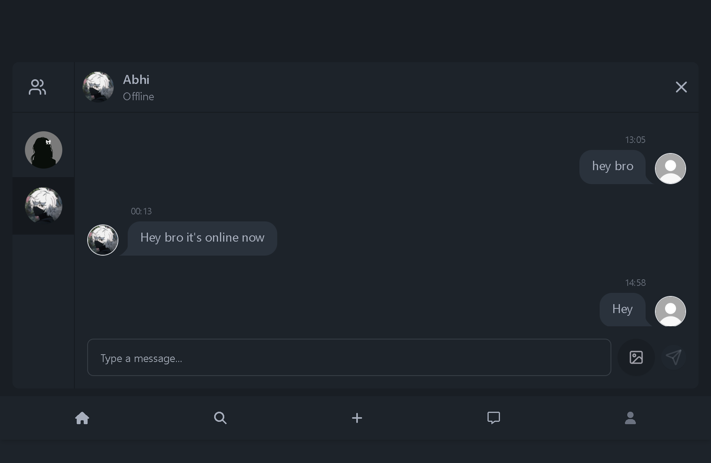

<h1>Fun-Blogging-App</h1>

A sleek and interactive blogging platform built with the MERN stack. Featuring real-time messaging, rich media uploads, and user-generated content, this app is perfect for anyone who wants to start a blog and interact with others in real time.

<h3> ✨ Features</h3>
Real-time Chat with Socket.IO: Interact with your readers and fellow bloggers through instant messaging.
User Authentication: Secure login/signup with session management using cookies.
Create & Share Blog Posts: Write and publish posts with rich text formatting.
Interactive Comments & Likes: Engage with blog content by commenting and liking posts.
User Profiles: Upload profile images and view other users' profiles.
Responsive Design: Fully responsive UI, perfect for desktops, tablets, and mobile devices.
Dark Mode: Switch between light and dark themes for a customizable reading experience.

<h3> 🚀 Tech Stack</h3>
Frontend: React, Redux, React Router, Socket.IO-client, TailwindCSS, daisyUI
Backend: Node.js, Express.js, Socket.IO, MongoDB, Cloudinary
Authentication: Cookie-based authentication (secure login)
Deployment: Vercel (frontend), Render (backend)
Database: MongoDB for storing users, posts, comments, etc.
Real-time Communication: Socket.IO for messaging functionality

<h3> 🎬 Demo </h3>
You can try out the app in its live state on the following platforms:

 <a href="https://fun-blogging-app.vercel.app">Vercel Link</a>

🔥 How It Works

Real-time Messaging: Users can chat with each other instantly while exploring blog posts. This is powered by Socket.IO to ensure smooth, real-time communication.
Post Creation: Users can create blog posts with Markdown support and attach images, making posts more interactive and engaging.
Commenting & Likes: Each post allows other users to comment and like, making the platform more social and engaging.
User Authentication: A simple and secure login system ensures that only registered users can create posts or comment on existing ones.

<h3>🖼️ Project Screenshots</h3>
Here are some images showcasing the functionality and design of the app:
</img>

</img>
